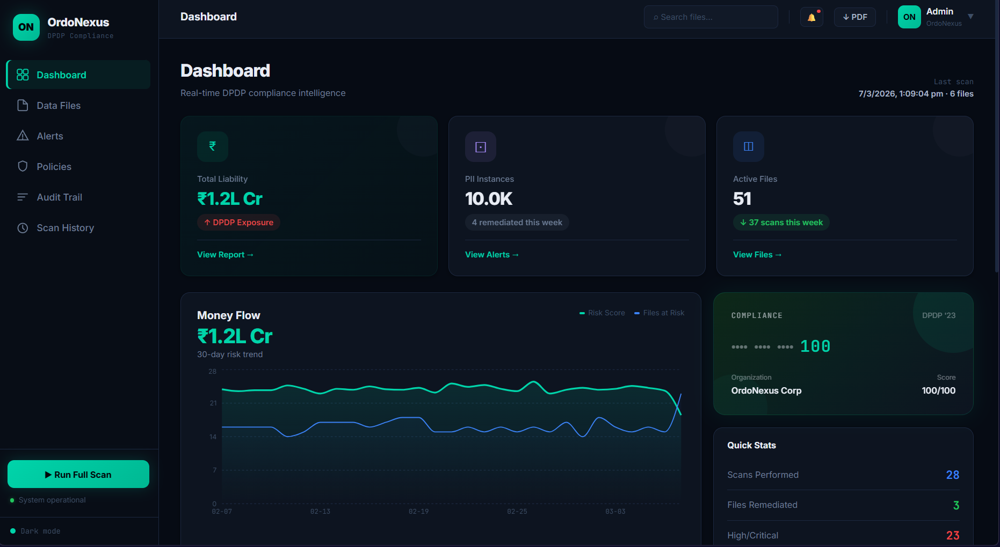

<<<<<<< HEAD
# OrdoNexus

> **AI-powered data compliance & risk intelligence platform** — Scan, classify, and remediate sensitive data across cloud storage with real-time risk scoring, DPDP policy tracking, and gamified compliance posture management.



---

## Tech Stack

### Frontend


### Backend


### Database & Infrastructure


-FF9900?style=for-the-badge&logo=amazons3&logoColor=white)

---

## Features

- **🔍 File Discovery & Scanning** — Scan mock S3 buckets, detect PII and sensitive data, and track scan history
- **⚠️ Risk Scoring Engine** — Auto-derives risk levels (LOW / MEDIUM / HIGH / CRITICAL) with financial liability estimates in INR
- **📊 Live Dashboard** — KPI summary cards, 30-day risk trend charts, bucket breakdowns, and recent activity feed
- **🚨 Alerts** — Filtered view of unremediated HIGH/CRITICAL files with owner attribution
- **📋 Policy Compliance** — DPDP Article-level checklist with pass/fail tracking
- **🗂️ Audit Log** — Immutable, append-only compliance trail with JSONB search support
- **🎮 Gamification** — Per-user compliance posture scoring and leaderboard via score rings
- **📄 PDF Reports** — One-click compliance report generation via ReportLab
- **🔁 Remediation Simulation** — Simulate file remediation and observe score/liability changes in real time

---

## Project Structure

```
OrdoNexus-main/
├── assets/
│   └── dashboard.png          # UI screenshot
├── frontend/
│   ├── src/
│   │   ├── pages/
│   │   │   ├── Dashboard.jsx
│   │   │   ├── FilesPage.jsx
│   │   │   ├── AlertsPage.jsx
│   │   │   ├── AuditPage.jsx
│   │   │   ├── PoliciesPage.jsx
│   │   │   └── ScanHistoryPage.jsx
│   │   ├── components/
│   │   │   ├── Sidebar.jsx
│   │   │   ├── BootScreen.jsx
│   │   │   ├── BootSequence.jsx
│   │   │   ├── ScoreRing.jsx
│   │   │   ├── Skeleton.jsx
│   │   │   └── Toast.jsx
│   │   └── App.jsx
│   └── package.json
├── backend/
│   ├── main.py                # FastAPI app & all endpoints
│   ├── models.py              # SQLAlchemy models
│   ├── services.py            # Business logic (scanning, scoring, etc.)
│   ├── report_generator.py    # PDF generation
│   ├── init_data.py           # Mock S3 seed structure
│   └── requirements.txt
└── sql/
    ├── 01_ddl_schema.sql      # Schema, triggers, views, indexes
    └── 02_seed_data.sql       # Demo data (60 files, 90 snapshots, etc.)
```

---

## Getting Started

### Prerequisites

- Node.js 18+
- Python 3.11+
- PostgreSQL 15+

---

### 1. Database Setup

```bash
# Create the database and user
psql -U postgres -c "CREATE DATABASE ordonexus;"
psql -U postgres -c "CREATE USER ordonexus WITH PASSWORD 'ordonexus';"
psql -U postgres -c "GRANT ALL PRIVILEGES ON DATABASE ordonexus TO ordonexus;"
psql -U postgres -d ordonexus -c "GRANT ALL ON SCHEMA public TO ordonexus;"

# Apply schema and seed data
psql -U ordonexus -d ordonexus -f sql/01_ddl_schema.sql
psql -U ordonexus -d ordonexus -f sql/02_seed_data.sql
```

---

### 2. Backend

```bash
cd backend

# Create and activate virtual environment
python -m venv venv
source venv/bin/activate        # Windows: venv\Scripts\activate
=======
# OrdoNexus - Shadow Data Governance Platform


**OrdoNexus** is a production-grade prototype Shadow Data Governance platform designed for **DPDP (Digital Personal Data Protection) compliance**. It automatically discovers, classifies, and assesses risk for sensitive information in local directories (simulating cloud storage), adhering to **Zero-Trust** and **data minimization** principles.

## 🎯 Key Features

### 🔍 Discovery Engine
- Automatic scanning of local filesystem (simulating S3 buckets)
- Supports multiple file formats (TXT, CSV, PDF, etc.)
- Auto-generates mock data for testing

### 🏷️ Classification Engine
- **PII Detection**: Aadhaar, PAN, GSTIN, Email
- **Zero-Trust Architecture**: Stores only metadata counts, never actual PII values
- Regex-based pattern matching with OCR support (pytesseract)

### ⚖️ Risk Scoring Engine
- **Formula**: `Risk = Sensitivity × Exposure × Staleness`
- **Sensitivity**: Based on PII type (Aadhaar=10, PAN=8, GSTIN=6, Email=3)
- **Exposure**: Based on bucket type (public_web=3.0, legacy_archive=2.0, finance_private=1.5)
- **Staleness**: Based on file age (>2 years=2.5x, >1 year=2.0x, >6 months=1.5x)

### 💰 Financial Liability Calculation
- Maps PII types to DPDP penalty amounts:
  - Aadhaar breach: ₹250 Crore
  - PAN breach: ₹50 Crore
  - GSTIN breach: ₹10 Crore
  - Email breach: ₹5 Crore

### 🎮 Gamification System
- **Data Responsibility Score** (0-100)
- Tracks scans performed and files remediated
- Dynamic scoring based on risk management actions

### 🔄 Remediation Simulation
- "What-If" analysis for file deletion/archival
- Shows potential risk reduction and financial savings
- Provides actionable recommendations

### 📊 Compliance Reporting
- Auto-generated PDF reports using ReportLab
- Executive summary with risk metrics
- High-risk file details and recommendations

### 📝 Immutable Audit Trail
- Logs all system actions (scans, simulations, reports)
- Timestamp and user tracking
- Required for DPDP compliance demonstration

## 🏗️ Architecture

```
OrdoNexus/
├── backend/                 # Python FastAPI Backend
│   ├── main.py             # FastAPI application & endpoints
│   ├── models.py           # SQLAlchemy database models
│   ├── services.py         # Core business logic
│   ├── init_data.py        # Mock data initialization
│   ├── report_generator.py # PDF report generation
│   └── requirements.txt    # Python dependencies
│
├── frontend/               # React Frontend
│   ├── src/
│   │   ├── App.jsx        # Main application component
│   │   ├── components/
│   │   │   ├── Dashboard.jsx          # Gamification & metrics
│   │   │   ├── ShadowDataGrid.jsx     # File inventory table
│   │   │   └── RemediationModal.jsx   # What-If analysis modal
│   │   ├── main.jsx       # React entry point
│   │   └── index.css      # Tailwind CSS styles
│   ├── package.json       # Node dependencies
│   ├── vite.config.js     # Vite configuration
│   └── tailwind.config.js # Tailwind configuration
│
├── mock_s3/               # Auto-generated mock data
│   ├── finance_private/   # Sensitive financial data
│   ├── public_web/        # Public-facing data
│   └── legacy_archive/    # Old archived data
│
├── run.bat                # Windows startup script
├── run.sh                 # Linux/Mac startup script
└── README.md              # This file
```

## 🚀 Quick Start

### Prerequisites

- **Python 3.8+** ([Download](https://www.python.org/downloads/))
- **Node.js 16+** ([Download](https://nodejs.org/))
- **npm** (comes with Node.js)

### Installation & Running

#### Windows
```bash
# Simply run the batch script
run.bat
```

#### Linux/Mac
```bash
# Make the script executable
chmod +x run.sh

# Run the script
./run.sh
```

The script will:
1. ✅ Check for Python and Node.js
2. ✅ Install Python dependencies (FastAPI, SQLAlchemy, ReportLab)
3. ✅ Install Frontend dependencies (React, Vite, Tailwind CSS)
4. ✅ Start Backend server on `http://localhost:8000`
5. ✅ Start Frontend server on `http://localhost:5173`
6. ✅ Auto-generate mock S3 data

### Manual Setup (Alternative)

#### Backend
```bash
cd backend

# Create virtual environment
python -m venv venv

# Activate virtual environment
# Windows:
venv\Scripts\activate
# Linux/Mac:
source venv/bin/activate
>>>>>>> upstream/main

# Install dependencies
pip install -r requirements.txt

<<<<<<< HEAD
# Configure environment
cp .env.example .env            # Set DATABASE_URL in .env

# Start the server
uvicorn main:app --reload --port 8000
```

API will be available at `http://localhost:8000`
Swagger docs at `http://localhost:8000/docs`

---

### 3. Frontend

```bash
cd frontend

npm install
npm run dev
```

App will be available at `http://localhost:5173`

---

## API Endpoints
=======
# Run server
python main.py
```

#### Frontend
```bash
cd frontend

# Install dependencies
npm install

# Run development server
npm run dev
```

## 📖 Usage Guide

### 1. Access the Application
- **Frontend Dashboard**: http://localhost:5173
- **Backend API**: http://localhost:8000
- **API Documentation**: http://localhost:8000/docs (Swagger UI)

### 2. Trigger a Scan
Click the **"🔍 Trigger Scan"** button to:
- Discover all files in `mock_s3/` directory
- Classify PII using regex patterns
- Calculate risk scores
- Update gamification metrics

### 3. View Shadow Data Inventory
The **Shadow Data Grid** displays:
- File names and bucket locations
- PII tags (Aadhaar, PAN, GSTIN, Email counts)
- Risk scores and levels (High/Medium/Low)
- Financial liability per file

### 4. Simulate Remediation
Click **"Simulate"** on any file to see:
- Risk reduction if file is deleted/archived
- Financial liability savings
- Updated responsibility score
- Actionable recommendations

### 5. Download Compliance Report
Click **"📄 Download Report"** to generate a PDF containing:
- Executive summary
- High-risk file details
- Total financial liability
- DPDP compliance recommendations

## 🔌 API Endpoints
>>>>>>> upstream/main

| Method | Endpoint | Description |
|--------|----------|-------------|
| `GET` | `/` | Health check |
<<<<<<< HEAD
| `POST` | `/scan` | Trigger a new scan run |
| `GET` | `/files` | List all scanned files |
| `GET` | `/dashboard/summary` | KPI summary for dashboard |
| `GET` | `/trends` | 30-day risk trend data |
| `GET` | `/alerts` | Active HIGH/CRITICAL alerts |
| `GET` | `/policies` | DPDP compliance checklist |
| `GET` | `/audit-log` | Full audit trail |
| `GET` | `/scan-history` | All past scan runs |
| `GET` | `/gamification` | User scores & leaderboard |
| `GET` | `/report` | Download PDF compliance report |
| `GET` | `/analytics/overview` | Aggregated analytics |
| `GET` | `/top-risky-files` | Top files by risk score |
| `POST` | `/simulate-remediation` | Simulate file remediation |

---

## Database Schema

The PostgreSQL schema includes **7 tables**, **3 views**, **3 triggers**, and **20+ indexes**.

| Table | Purpose |
|-------|---------|
| `file_metadata` | Core — one row per file, PII counts + risk scores |
| `scan_runs` | Scan execution history |
| `audit_log` | Immutable append-only compliance trail |
| `user_scores` | Per-user compliance posture |
| `risk_snapshots` | Daily aggregated risk trend data |
| `policy_checks` | DPDP Article compliance checklist |
| `data_owners` | Bucket-to-team ownership mapping |

**Key views:** `v_dashboard_summary` · `v_active_alerts` · `v_bucket_breakdown`

---
=======
| `POST` | `/scan` | Trigger filesystem scan |
| `GET` | `/files` | Get all scanned files with risk scores |
| `POST` | `/simulate-remediation?file_id={id}` | Simulate file remediation |
| `GET` | `/gamification` | Get user's Data Responsibility Score |
| `GET` | `/report` | Generate and download PDF report |
| `GET` | `/audit-log` | View immutable audit trail |

## 🗄️ Database Schema

### FileMetadata
- Stores file paths, bucket names, file sizes
- PII counts (aadhaar_count, pan_count, gstin_count, email_count)
- Risk scoring components (sensitivity, exposure, staleness, final_risk_score)
- **Zero-Trust**: Only stores counts, never actual PII values

### AuditLog
- Immutable audit trail
- Tracks all actions (SCAN, SIMULATE_REMEDIATION, REPORT_GENERATED)
- Timestamp, user_id, file_id, details (JSON)

### UserScore
- Gamification data
- responsibility_score (0-100)
- high_risk_files_remediated
- scans_performed

## 🎨 Frontend Design

The frontend features a **premium, modern design** with:
- 🌌 **Dark mode** with gradient backgrounds
- 💎 **Glassmorphism** effects on cards
- 🎯 **Dynamic color coding** (Red/Yellow/Green for risk levels)
- ✨ **Smooth animations** and hover effects
- 📱 **Responsive layout** (mobile-friendly)
- 🎨 **Tailwind CSS** for utility-first styling

## 🔒 Security & Compliance

### Zero-Trust Architecture
- **Never stores actual PII values**
- Only metadata (counts) are persisted
- Follows data minimization principle

### DPDP Compliance
- Risk-based approach to data governance
- Financial liability mapping to DPDP penalties
- Audit trail for all actions
- Automated compliance reporting

### Data Minimization
- Staleness multiplier encourages deletion of old data
- Remediation recommendations based on file age
- "What-If" analysis promotes proactive data cleanup

## 🧪 Testing

The application comes with **pre-populated mock data**:

| Bucket | Files | PII Types |
|--------|-------|-----------|
| `finance_private` | customer_data_dump.txt, salary_records_2023.csv | Aadhaar, PAN, GSTIN, Email |
| `public_web` | website_contact_list.csv, blog_posts.txt | Email |
| `legacy_archive` | 2019_transactions.txt, backup_2018.log | Aadhaar, PAN, Email |

**Expected Results After First Scan**:
- Total files: 6
- High-risk files: 3-4 (finance_private and legacy_archive)
- Total financial liability: ₹500+ Crore
- Responsibility score: Decreases based on high-risk count

## 🛠️ Tech Stack

### Backend
- **FastAPI** - Modern Python web framework
- **SQLAlchemy** - ORM for database operations
- **SQLite** - Lightweight SQL database
- **ReportLab** - PDF generation
- **Uvicorn** - ASGI server

### Frontend
- **React 18** - UI library
- **Vite** - Build tool and dev server
- **Tailwind CSS** - Utility-first CSS framework
- **Axios** - HTTP client

## 📦 Dependencies

### Backend (`requirements.txt`)
```
fastapi==0.109.0
uvicorn[standard]==0.27.0
sqlalchemy==2.0.25
python-multipart==0.0.6
reportlab==4.0.9
```

### Frontend (`package.json`)
```json
{
  "dependencies": {
    "react": "^18.2.0",
    "react-dom": "^18.2.0",
    "axios": "^1.6.5"
  },
  "devDependencies": {
    "@vitejs/plugin-react": "^4.2.1",
    "tailwindcss": "^3.4.1",
    "vite": "^5.0.11"
  }
}
```

## 🚧 Future Enhancements

- [ ] AWS S3 integration (replace mock filesystem)
- [ ] OCR support for scanned PDFs (pytesseract integration)
- [ ] Multi-user authentication and authorization
- [ ] Advanced PII detection (phone numbers, credit cards)
- [ ] Automated remediation workflows
- [ ] Real-time notifications
- [ ] Dashboard analytics and charts
- [ ] Export to Excel/CSV

## 📄 License

This is a prototype for educational and demonstration purposes.

## 🤝 Contributing

This is a local prototype. For production use, consider:
- Implementing proper authentication
- Using PostgreSQL instead of SQLite
- Adding comprehensive error handling
- Implementing rate limiting
- Adding unit and integration tests
- Securing API endpoints with proper authorization

## 📞 Support

For issues or questions:
1. Check the API documentation at http://localhost:8000/docs
2. Review the audit log at http://localhost:8000/audit-log
3. Check browser console for frontend errors
4. Check terminal output for backend errors

---

**Built with ❤️ for DPDP Compliance**
>>>>>>> upstream/main
